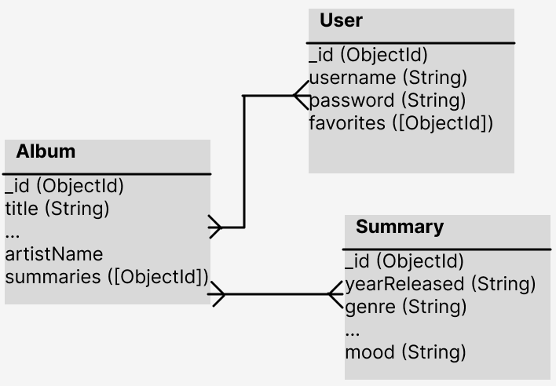

# Albumsaurus

## Premise: 
Albumsaurus is full stack web app that allows users to discover and learn about different albums in a Netlifx-style UI. By clicking on an album's artwork or title on screen, the SHOW page will display to the user that album's release date, genre, personnel, (and ideally some billboard chart info, i.e. top spot)

## The User Story:

## The Wireframe:

## The ERD: 

## Route Table:
| **URL**          | **HTTP Verb**|**Action**|
|----------------------|--------------|----------|
| /albums              | GET          | index  
| /albums/new          | GET          | new      
| /albums              | POST         | create    
| /albums/:id          | GET          | show   
| /albums/:id/edit     | GET          | edit     
| /albums/:id/favorite | GET          | favorite      
| /albums/:id          | PUT          | update    
| /albums/:id          | DELETE       | delete  

## Technologies Used:
- Deezer API
- Last FM API
- MongoDB
- Express
- Node
- JavaScript
- CSS
- HTML5

## How To Use:

## MVP Requirements:
- [] Have at least 2 models (more if they make sense) that represents the main functional idea for your app.
- [x] Incorporate at least one API. List of examples here: (Public API List)[https://github.com/public-apis/public-apis].
- [x] Have complete RESTful routes for at least one of your resources with GET, POST, PUT, and DELETE
- [x] Utilize an ODM to create a database table structure and interact with your MongoDb-stored data
- [] Include a readme file that explains how to use your app and contains a route table for your RESTful routes
- [] Have semantically clean HTML, CSS, and back-end code
- [] Be deployed online and accessible to the public

## Stretch goals / ICE BOX:
- [x] User creation and authorization
- [] Give users the ability to search through their favorite albums for quicker future reference
- [] Replace Last FM API with an API that has wiki summaries and additional interesting data on a higher percentage of albums (examples below)
    - [] https://developer.musixmatch.com/documentation/api-reference/album-get
    - [] https://developer.napster.com/api/v2.2#albums
    - [] https://www.theaudiodb.com/api_guide.php
- [] Display how many users have an album saved
